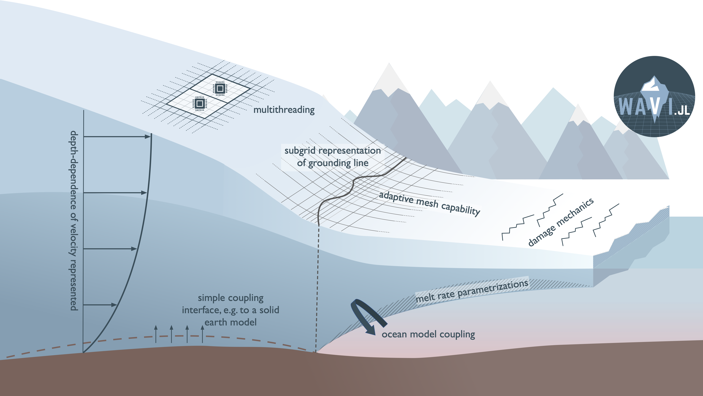

Ice sheet models allow us to simulate the behaviour and evolution of ice sheets, which are large masses of glacial land ice. There are two main uses of ice sheet models: firstly, prognostic usage, which involves making predictions about the future of ice sheets. Prognostic predictions often relate to sea level rise: the world's two largest ice sheets, located in Antarctica and Greenland, hold enough ice to raise sea levels by approximately 58 and 7 meters, respectively [@Bamber2018]; prognostic modelling of these ice sheets enables us to make predictions on (for example) how much of this ice will be lost [@Edwards2021], to investigate the possibility of runaway ice loss [@DeConto2021], and analyze whether or not such instabilities have already been initiated [@Favier2014]. Secondly, ice sheet models are also used diagnostically, which involves using a model to investigate processes controlling the behaviour of an ice sheet, such as how loss of ice shelves -- the floating extensions of ice sheets -- ice influences ice flow speed [@Joughin2021], how different bed conditions affect ice sliding [@DeRydt2021], and probing the conditions under which instabilities might be triggered [@Schoof2007].

On the long [O(1000s km)] lengthscales that are relevant to ice sheets, ice behaves approximately as a highly viscous fluid with a shear-thinning rheology (meaning that as the ice deforms, it becomes thinner). `WAVI.jl` (Wavelet-based Adaptive-grid Vertically-integrated Ice-sheet-model) is a Julia package for the numerical solution of an accurate approximation to the Stokes equations, which describe conservation of mass and momentum in such a fluid. This approximation, which is appropriate for fluid flows with a high aspect ratio (as is the case for the vast majority of ice sheets), treats longitudinal and lateral stresses as depth independent, but accounts for vertical velocity gradients in the nonlinear viscosity and in the treatment of basal stress[@Goldberg2011] [@Arthern2015].

Physically, ice sheets do not stand alone, but are forced by other parts of the climate system. For example, the recent rapid changes that have occurred in the West Antarctic Ice Sheet in the previous decades are understood to have been driven by an increase in oceanic heat content reaching the floating ice shelves which fringe this region[@Pritchard2012]. For basal melting in particular, `WAVI.jl` includes a broad range of community parametrizations (analytic approximations to) of basal melting [@AsayDavis2017], as well as a developmental coupling with the ocean general circulation model MITgcm [@Marshall1997]. More generally, `WAVI.jl` leverages Julia's multiple dispatch paradigm to create a simple, user-friendly interface for embedding models of other physical processes, such as ice damage, ice shelf calving, and solid earth effects, into `WAVI.jl`.

`WAVI.jl` is designed to be usable by anyone interested in ice sheet modelling, from students with no programming experience to experienced researchers in the field and everyone in between. To facilitate detailed research, including simulations at high spatial and temporal resolution, `WAVI.jl` employs a number of tools to improve computational speed, including multithreading capabilities, an adaptive numerical grid and a wavelet-based preconditioner [@Arthern2017]. To facilitate accessibility, `WAVI.jl` includes a simple, user friendly API, and is aided by Julia's convenient syntax. In addition, the Github repository in which the code is stored includes a number of well-documented examples, which demonstrate the software's capabilities in a wide variety of situations.

{ width=90% }

`WAVI.jl` is the successor to a similar code, written in the proprietary programming language MATLAB, but not publicly released. This code has been used extensively as research software [e.g. [@Arthern2017]], as well as having participated in the most recent ice sheet model intercomparison exercise [@Cornford2020], which acts as a benchmark for ice-flow models. `WAVI.jl`, has also been verified independently against these benchmark experiments.

There currently exists a wide variety of ice sheet models of varying complexity. Examples include (but are certainly not limited to) the Ice Sheet System Model [@Larour2012], the Parallel Ice Sheet Model [@Bueler2009], BISICLES [@Cornford2013],  Elmer/Ice [@Gagliardini2013], and Úa [@Gudmundsson2019]. Since every ice sheet model makes approximations in order to facilitate the numerical solution of the appropriate governing equations, and the fact that these equations lack analytic solutions, means that the _intercomparison_ between ice sheet models is of paramount importance when assessing the trustworthiness of models; `WAVI.jl` contributes to this community of ice sheet models. `WAVI.jl` is also, to our knowledge, the first ice sheet model written entirely in Julia and, alongside other accessible ice sheet models such as IcePack [@Shapero], helps to lower the barrier to entering ice sheet modelling.

# Acknowledgements

We are grateful for financial contributions from NERC and ?.
We thank Xy Wang and Daniel Goldberg for conversations which improved the code. Thanks also go to Bryony Freer for designing to logo.

# References
